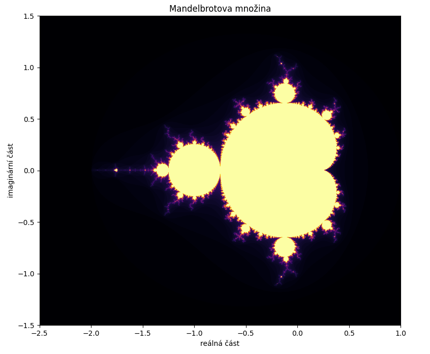
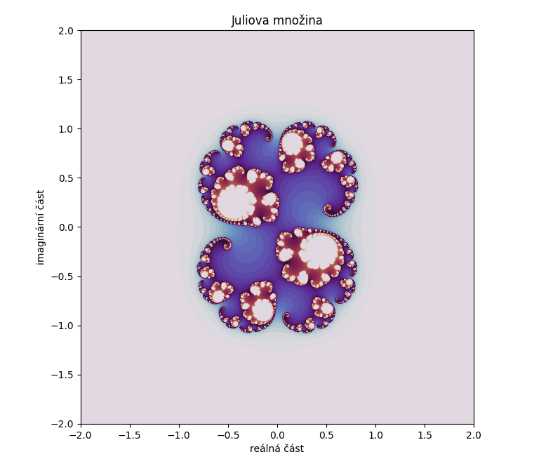

# Mandelbrotova a Juliova množina – vizualizace

## Popis projektu

Tento projekt implementuje a vizualizuje **Mandelbrotovu** a **Juliovu** množinu pomocí jazyka Pythonu a knihoven `numpy` a `matplotlib`. Uživatel může interaktivně prozkoumávat tyto fraktály změnou parametrů jako rozsah komplexní roviny, počet iterací nebo barevné schéma.

## Hlavní funkce knihovny

- Výpočet Mandelbrotovy množiny v daném rozsahu
- Výpočet Juliovi množiny v daném rozsahu
- Interaktivní vizualizace s ovládacími prvky (slidery, radio tlačítka, range slidery).
- Možnost měnit barevné schéma vykreslení.

## Jak projekt používat

1. Načtěte knihovny ze souboru fraktaly_cieslar.ipynb
2. Spusťte jednotlivé buňky s funkcemi `mandelbrot_set`, `julius_set`, `vizualizace_mandelbrot`, `vizualizace_julius` a hlavní buňku, kde se volají obě funkce na vizualizaci s výchozími hodnotami
3. Využijte interaktivní ovládací prvky ke změně parametru a průzkumu množin.

### Ukázky výstupu

**Mandelbrotova množina:**

**Juliova množina:**

